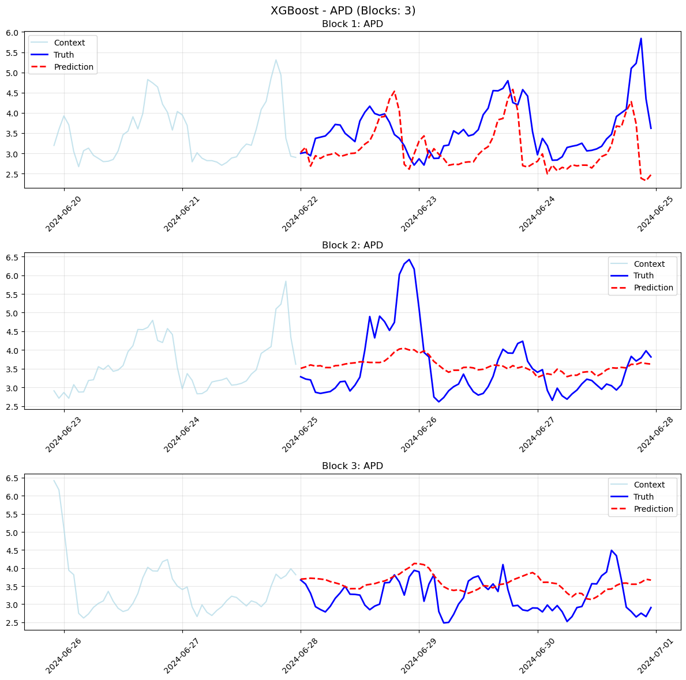
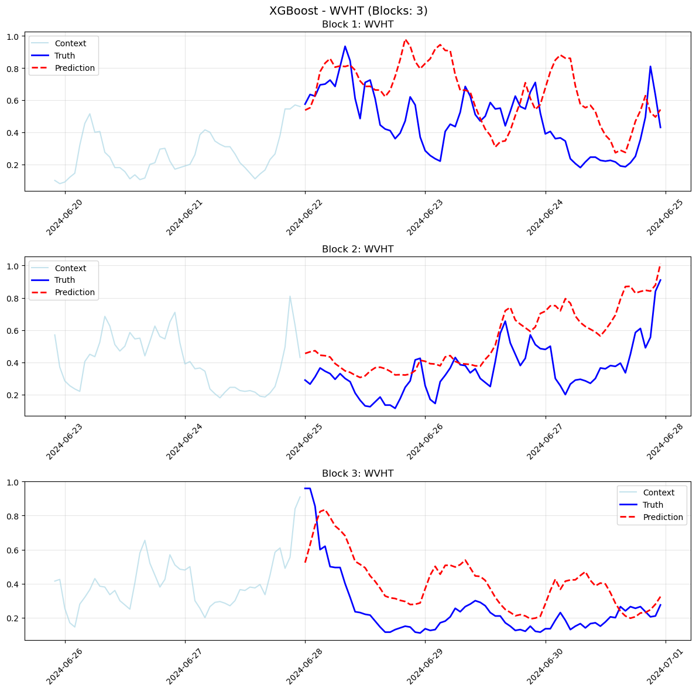
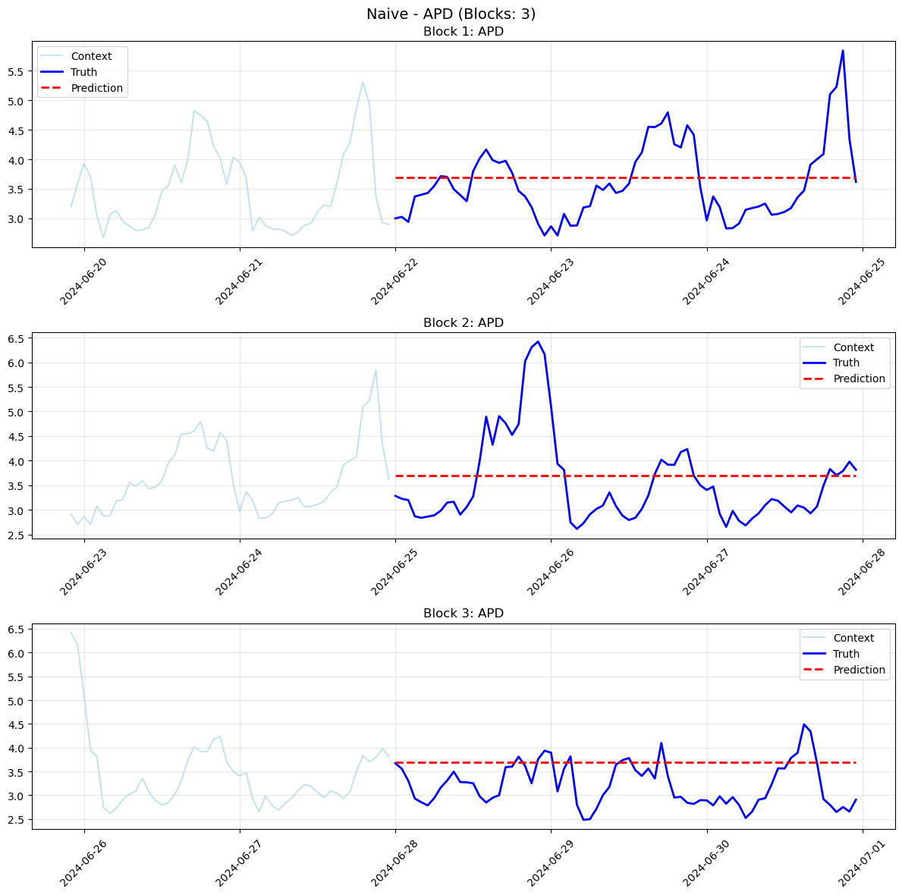
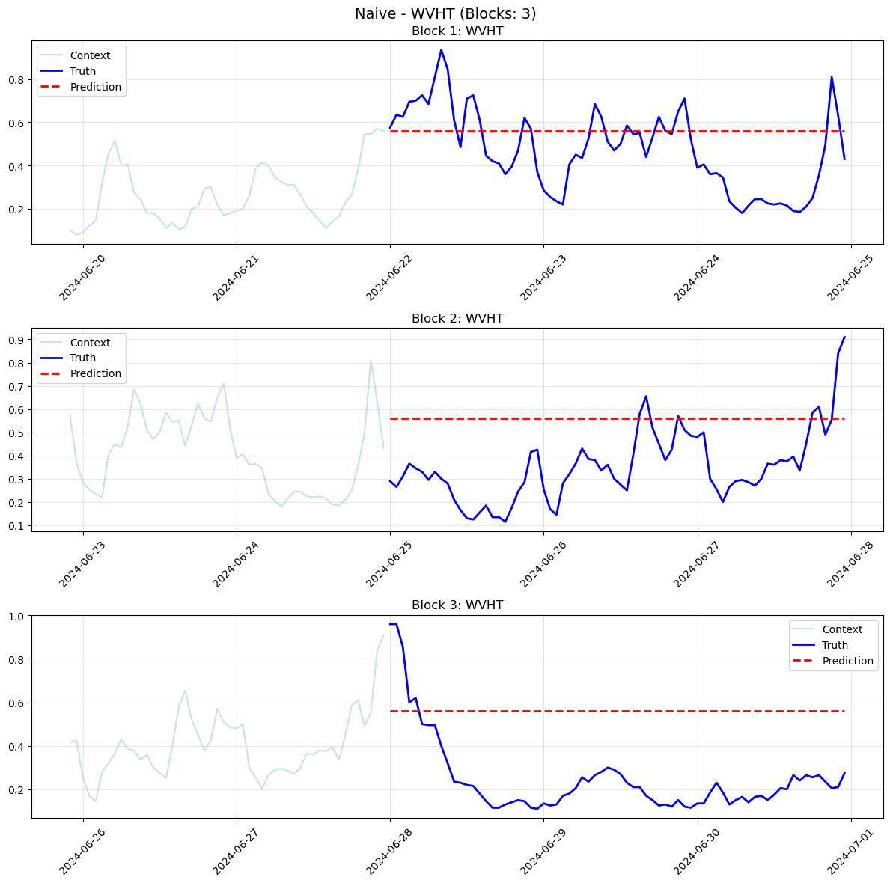
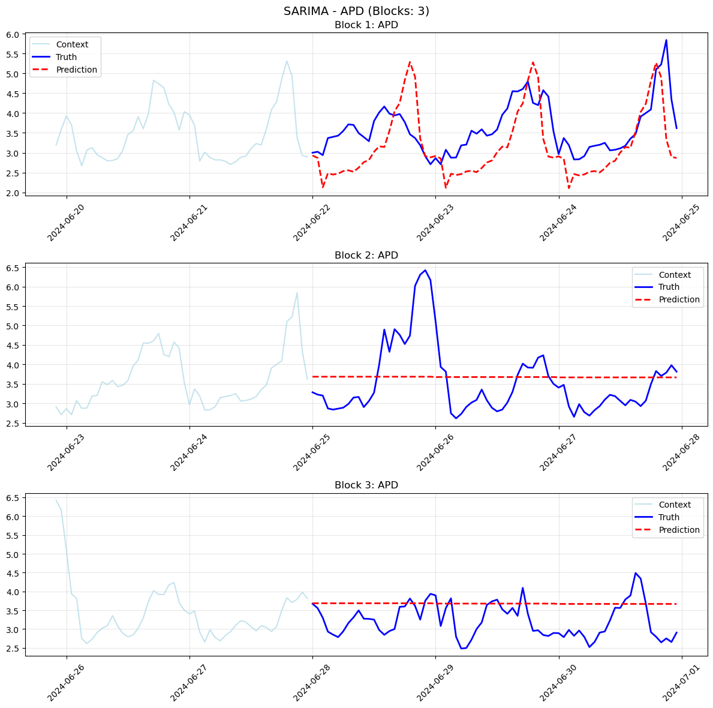
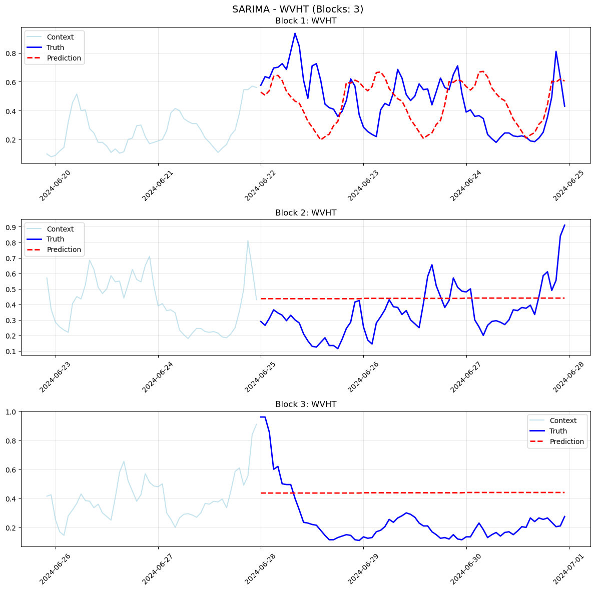
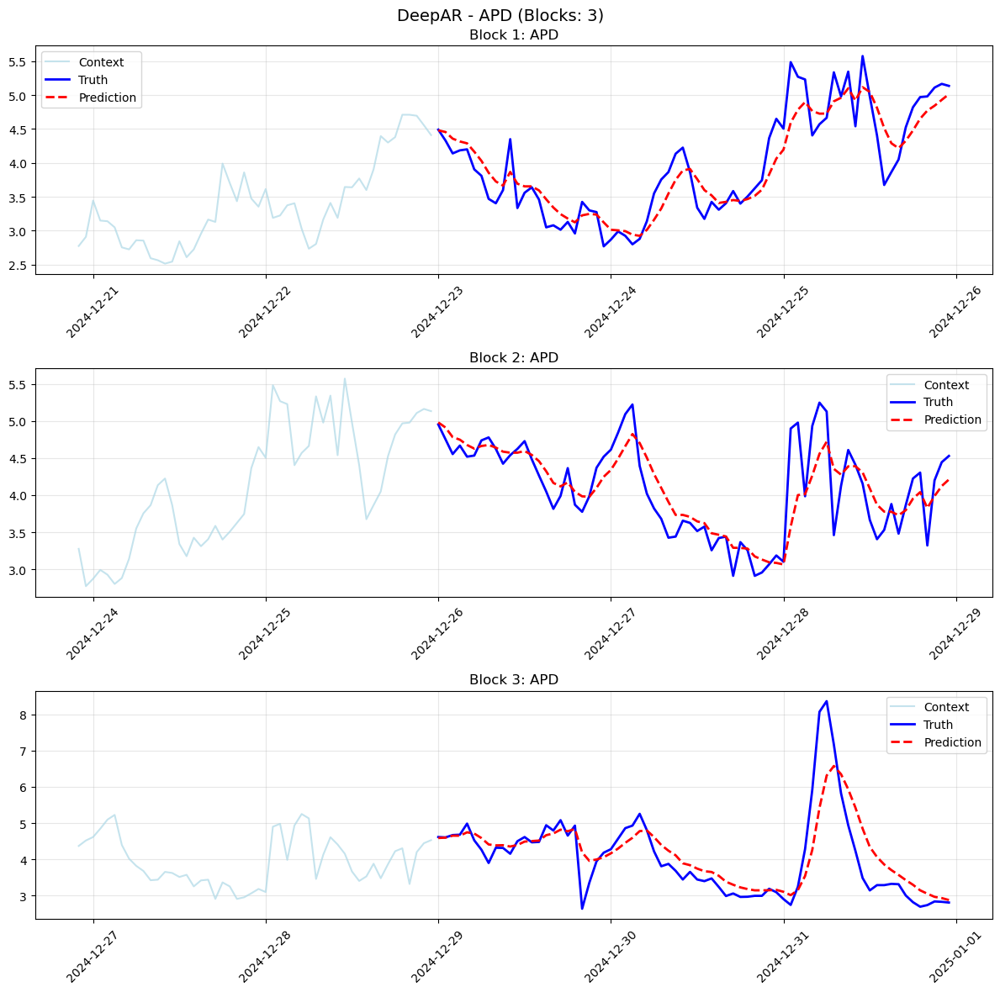
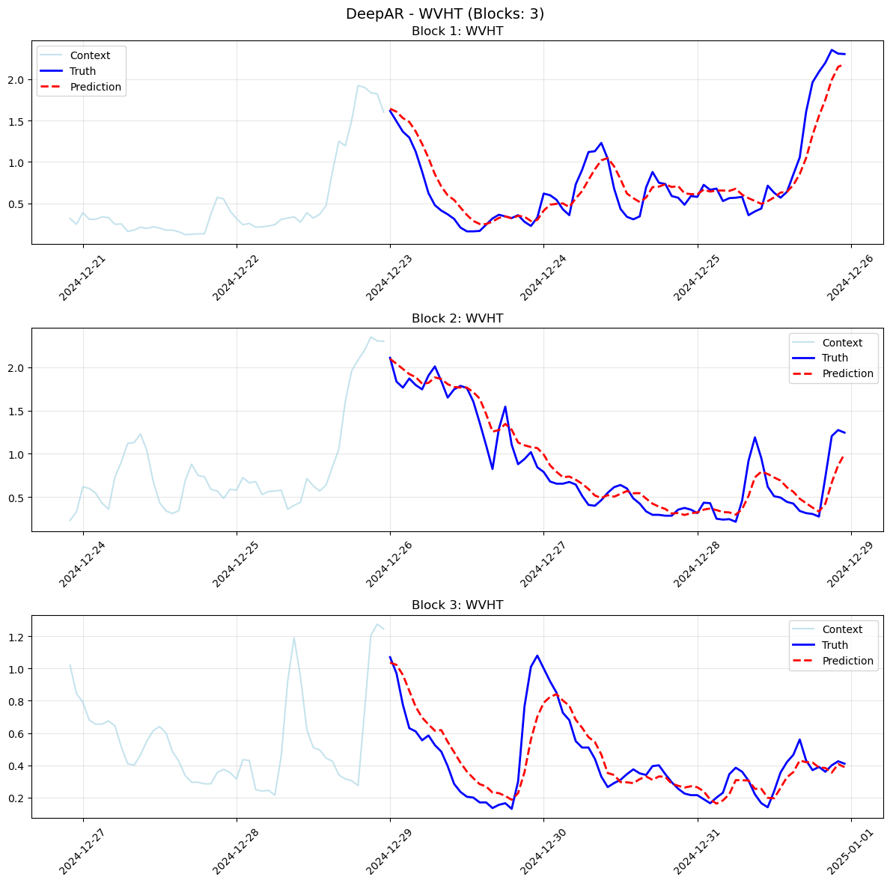

# Ocean Wave Forecasting Model

## WHAT
End-to-end pipeline for ocean wave forecasting and prediction using NOAA data
- Data preprocessing, splitting, and transformation utilities
- Feature engineering for time series and exogenous variables
- Custom pipelines for scaling, differencing, and lag creation
- Multiple forecasting models: XGBoost, SARIMA, Naive, DeepAR
- Model evaluation and block-wise benchmarking utilities
- MLflow integration for experiment tracking and results
- Visualization tools for inspection and model evaluation

## INSTRUCTION
1. Prepare and preprocess raw oceanographic data from NOAA
2. Engineer features and transform data for modeling
3. Train and evaluate forecasting models using block-wise backtesting
4. Track experiments and metrics with MLflow
5. Visualize predictions and benchmarking results

## DATA

Data Description:
Source: https://www.ndbc.noaa.gov/station_history.php?station=46088
Station: 46088 (center of the Salish sea), year 2024 (complete year data)
Three datasets used:
  - Standard Meteorological Data
  - Supplemental Measurements Data
  - Wave Spectral Density Data

Wave measurement details:
https://www.ndbc.noaa.gov/faq/wave.shtml
https://www.weather.gov/dlh/WaveHeightExplanation

### THE THREE FOLDERS

**1. Standard Meteorological Data**
| Variable | Description | Units |
|----------|-------------|-------|
| WDIR     | Wind direction (degrees from true N) | °T |
| WSPD     | Wind speed (avg) | m/s |
| GST      | Peak gust speed | m/s |
| WVHT     | Significant wave height | m |
| DPD      | Dominant wave period | s |
| APD      | Average wave period | s |
| MWD      | Wave direction at dominant period | °T |
| PRES     | Sea-level pressure | hPa |
| ATMP     | Air temperature | °C |
| WTMP     | Sea surface temperature | °C |
| DEWP     | Dewpoint temperature | °C |
| VIS      | Visibility | nmi |
| PTDY     | 3-hr pressure tendency | hPa |
| TIDE     | Water level relative to MLLW | ft |

**2. Supplemental Measurements Data**
| Variable | Description | Units |
|----------|-------------|-------|
| PRES     | Lowest 1-min pressure in the hour | hPa |
| PTIME    | Time of lowest-pressure measurement | hhmm |
| WSPD     | Highest 1-min wind speed in the hour | m/s |
| WDIR     | Direction of that gust | °T |
| WTIME    | Time of highest-wind measurement | hhmm |

**3. Wave Spectral - Density Data**
- Date/Time fields: YY MM DD hh mm (UTC)
- Frequency bins: e.g. .0200, .0325, ..., .4650 (Hz)
- Spectral densities: floating-point values (m²/Hz) for each frequency bin
- 0.00 means no measurable energy in that bin at that time

## BENCHMARKING RESULTS

Block-wise prediction visualizations for each model and target:

**XGBoost:**
- 
- 

**Naive Forecaster:**
- 
- 

**SARIMA:**
- 
- 

**DeepAR:**
- 
- 

Each figure shows block-wise predictions vs ground truth for the respective model and target variable.

--------

